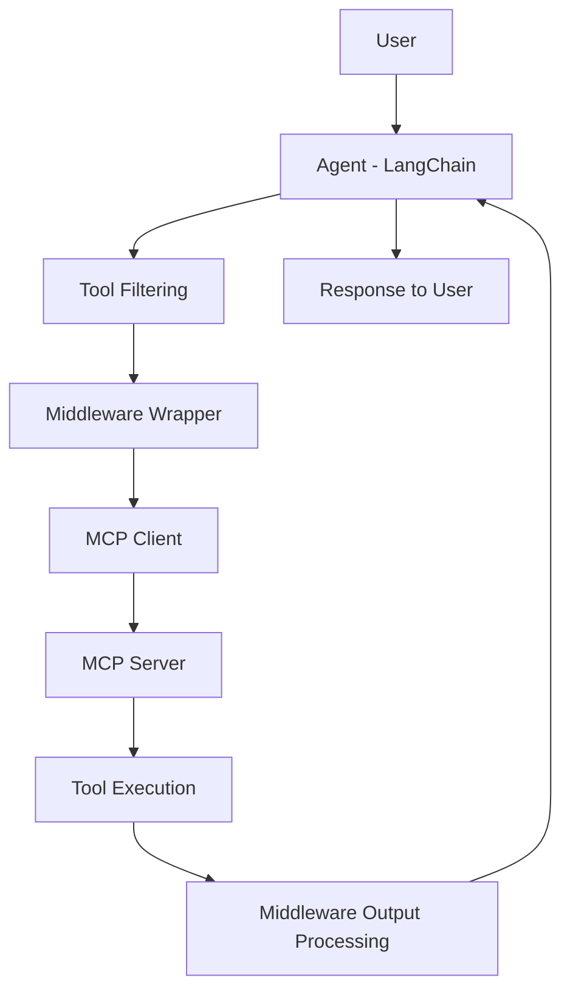

# 🤖 MCP Agent with Middleware and Tool Filtering

This project demonstrates various use cases and functionality in LangChain through practical agent examples.

## 📌 Project Description

This project demonstrates how to build an AI agent using MCP (Model Context Protocol), where the agent can interact with external tools exposed through an MCP server.

The system solves a practical problem by:

- automating text processing
- performing mathematical calculations
- enabling structured tool usage through MCP


---

## 🧱 Features

### ✅ MCP Server
The MCP server provides 5 tools:

- `count_words`
- `count_characters`
- `to_uppercase`
- `add_numbers`
- `multiply_numbers`

All tools use:
- `Annotated`
- `Field`

This ensures clear type definitions and structured input handling.

---

### ✅ Agent
The agent:
- is built using LangChain
- connects to the MCP server
- interacts with tools dynamically

---

### ✅ Tool Filtering
Not all tools are exposed to the agent.

Example:
```python
allowed_tool_names = [
    "count_words",
    "add_numbers",
    "to_uppercase"
]
```

This ensures better control, safety, and relevance.

---

### ✅ Middleware (Wrapper)
Middleware is implemented to:

#### 1. Modify Output
```
10 → "Result is: 10"
hello → "Processed text: HELLO"
```

#### 2. Handle Invalid Input
The agent may send:
```
"7+3"
```

Middleware converts it into:
```json
{ "a": 7, "b": 3 }
```

This ensures compatibility with MCP tool schemas.

---

## 🔄 Flow Diagram



---


## Getting Started

### Prerequisites
- Python 3.13
- Ollama server with access to Llama models

## ⚙️ Installation Setup

### 1. Clone the repo-project
 Clone repository
```bash
git clone <your-repo-url>
cd nackademin-langchain-demo2

2. Create a virtual environment and install dependencies:
```bash
python3.13 -m venv .venv
source .venv/Scripts/activate           # Windows
pip install -r requirements.txt         
```
3. Create a `.env` file with your configuration:
```bash
OLLAMA_BASE_URL=http://nackademin.icedc.se
OLLAMA_BEARER_TOKEN=your-bearer-token-here
```

### ▶️Running the Project

Make sure the virtual environment is activated and run from the project root:

```bash
source .venv/bin/activate
```

### Start MCP Server
```bash
python -m calculator_mcp.calculator_mcp2
```


### Start Agent
```bash
python -m examples.tool_lecture._mcp.agent3
```

---

## 💬 Example Usage

### Input:
```
What is 7 + 3?
```

### Output:
```
Result is: 10
```

---

### Input:
```
Convert this to uppercase: hello world
```

### Output:
```
Processed text: HELLO WORLD
```

---

## 🧠 Reflection

This project demonstrates:
- how AI agents can integrate with external systems via MCP
- how middleware can control both input and output
- how tool filtering improves reliability and safety

---


## 🚀 Future Improvements

- Support for more mathematical operations
- Multi-server MCP setup
- More advanced natural language parsing
- User interface for interaction

---

## 👩‍💻 Author
Student project – AI & MLOps